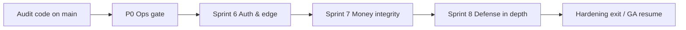

# Phase Audit Hardening — Sprint Phase Plan

- **Status:** Proposed 2026-08-07 (post–platform audit)
- **Cadence:** 1-week phases (P0 ops gate) then **2-week sprints** (S6–S8)
- **Source of truth (findings):** [`docs/PLATFORM_AUDIT_2026-08-07.md`](./PLATFORM_AUDIT_2026-08-07.md)
- **Code already on `main`:** Critical C1–C5 + selected High/Medium remediations (commit `88ab3ac`)
- **Does not replace:** Locked Epics 1–2 plan ([`docs/sprint-plan.md`](./sprint-plan.md)) or Phase GA ([`docs/phase-ga-go-live.md`](./phase-ga-go-live.md)) — this phase runs **in parallel / immediately after** GA ops for security debt
- **Conventions:** same as locked sprint plan (migrations ADR-0001, integer cents ADR-0011, idempotency ADR-0009, PayPal-only ADR-0016)

---

## Program position

| Before | This phase |
|--------|------------|
| Audit found Critical risk; code fixes landed on `main` | **Make fixes live** + close remaining High/Medium |
| Migration `033` written, **not necessarily applied** in Supabase | Ops gate blocks “hardened” claim until applied |
| Phase GA = rehearsal / first live event | Audit hardening = **security & money-path integrity** |



---

## Exit criteria (phase complete when all true)

1. Migration `033` applied on staging **and** production; smoke checks in P0 pass.
2. No open **High** findings from the audit remain (H2, H3, H6, H8 closed or accepted with written waiver in LEDGER).
3. Money-path races (M2, M6, M9 inventory) mitigated with unique constraints + conditional updates + tests.
4. Durable rate limit store used for auth, SMS share, admin login, cashout.
5. Authz regression tests cover create-order tickets, register, payouts, cashout.
6. `npm run validate` green; PayPal sandbox rehearsal still passes (`npm run paypal:rehearsal`).

---

## P0 — Ops gate (1 week, blocking)

**Goal:** Deploy the audit remediations that only work after DB/env work. No new features.

| # | Deliverable | Owner | Done when |
|---|-------------|-------|-----------|
| P0.1 | Apply `033_security_hardening.sql` on **staging** | Ops / Eng | Triggers exist; client cannot `UPDATE profiles.role`; `paypal_orders` client INSERT denied |
| P0.2 | Apply `033` on **production** | Ops | Same checks on prod project |
| P0.3 | Set `PAYPAL_WEBHOOK_ID` on Vercel (Production + Preview) | Ops | Webhook verify succeeds; `PAYPAL_WEBHOOK_SKIP_VERIFY` **unset** in prod |
| P0.4 | Audit `profiles.role = 'admin'` rows | Eng + Owner | Spreadsheet of rows; revoke any not tied to `platform_admins` / `OWNER_*` |
| P0.5 | Rotate `PLATFORM_ADMIN_PASSWORD` | Ops | New secret in Vercel; old password fails login |
| P0.6 | Manual smoke (staging) | Eng / QA | (1) ticket create-order ignores underpayment (2) register rejects `type=ticket` (3) organizer cannot set payout `completed` (4) cashout 403 with null owner (5) draft event GET 404 for anon |

**Exit:** P0.1–P0.6 complete → start Sprint 6.  
**Rollback:** Keep previous migration backup; password rotate is one-way — store new secret in password manager first.

---

## Sprint 6 — Auth & edge controls (2 weeks)

**Goal:** Close remaining **High** auth findings (H2, H3, H6, H8).

| # | Finding | Deliverable | Done when |
|---|---------|-------------|-----------|
| S6.1 | H2 | Retire shared-only admin model: prefer Twilio Verify OTP for `/admin/login` (`PLATFORM_ADMIN_USE_TWILIO=true`) **or** per-admin secrets; stop returning `refresh_token` in JSON where cookies suffice | Admin login works without shared password as sole factor; tokens not in response body (or httpOnly cookie only) |
| S6.2 | H3 | Phone OTP on roster number must **not** auto-mint full platform-admin session without second factor (password or admin OTP step) | `/api/auth/verify/check` no longer elevates to admin solely from phone match |
| S6.3 | H6 | Durable rate limit (Upstash Redis / Vercel KV) behind `lib/rate-limit.ts` | Auth, admin login, SMS share, cashout share one store across instances |
| S6.4 | H8 | Add `middleware.ts`: security headers consistency, basic bot/abuse hooks, rate-limit attachment for `/api/auth/*`, `/api/admin/auth/*`, `/api/donations/share` | Middleware present; public donate/bid paths not broken |
| S6.5 | — | ADR: “Platform admin authentication” (successor note to ADR-0010 / admin console) | ADR accepted in `docs/adrs/` |
| S6.6 | — | Tests: admin elevation negative cases; rate limit unit with mocked store | Jest green |

**Out of scope:** Redesigning organizer UX; new payment providers.

**Exit:** H2/H3/H6/H8 closed or LEDGER waiver; admin login rehearsal on staging.

---

## Sprint 7 — Money-path integrity (2 weeks)

**Goal:** Close payment/ledger Medium findings that can cause undercharge, oversell, or double credit.

| # | Finding | Deliverable | Done when |
|---|---------|-------------|-----------|
| S7.1 | M2 | On capture: compare PayPal captured amount/currency to `paypal_orders.amount_cents`; reject mismatch | Underpay/overpay capture fails closed; test with mocked capture |
| S7.2 | M6 | Unique constraint on donation capture / order id; conditional status updates (`WHERE status = 'pending'`); webhook + capture-order share one idempotent writer | Concurrent capture + webhook → single P2P credit |
| S7.3 | M9 | Atomic ticket inventory SQL (`UPDATE … WHERE quantity_sold + :n <= quantity_total RETURNING`) | Parallel checkouts cannot oversell |
| S7.4 | M9 | Auction register: bind vault token to PayPal vault setup session for that user/auction — reject arbitrary client tokens | Only tokens from `/vault/setup` → `/vault/confirm` accepted |
| S7.5 | Follow-up | Migrate PayPal fee helpers to integer cents (`lib/money`) on create-order / capture / webhook | No float fee math on new writes; ADR-0011 aligned |
| S7.6 | — | Integration tests for create-order ticket pricing + capture reconcile | `__tests__/integration` or route-level tests green |

**Out of scope:** Changing platform fee %.

**Exit:** Sandbox donation + ticket + P2P attribution rehearsal with forced double-webhook shows single credit; inventory stress (parallel requests) holds.

---

## Sprint 8 — Defense in depth & hygiene (2 weeks)

**Goal:** Remaining Medium/Low surfaces, observability, and regression harness.

| # | Finding | Deliverable | Done when |
|---|---------|-------------|-----------|
| S8.1 | M4 | CORS: document required exact `NEXT_PUBLIC_APP_URL`; fail CI/preview check if missing/wildcard | Runbook + env validation script or `ga:status` check |
| S8.2 | M5 | Harden `/api/health/advanced` — auth or strip memory/uptime/env detail for anon | Public response is liveness only |
| S8.3 | L stubs | Gate or remove open stubs (`/api/ai/suggestions`, `/api/insights`, `/api/impact`, `/api/templates`, `/api/verification`) | 401/410/501 with no echo of organizer ids |
| S8.4 | — | Authz API tests: register, payouts, cashout, create-order, draft event GET | Coverage listed in audit Testing notes automated |
| S8.5 | — | Update `SECURITY_COMPLIANCE.md` + LEDGER with hardening complete date | Docs match shipped controls |
| S8.6 | — | Re-run focused audit checklist; mark Phase Audit Hardening **Complete** in LEDGER | No open High; Medium accepted or closed |

**Exit:** Phase exit criteria §1–6 all true.

---

## Workstream ownership (suggested)

| Stream | Primary | Supports |
|--------|---------|----------|
| Ops / env / migrations | Ops | Eng |
| Admin auth & middleware | Eng | Security-minded review |
| PayPal capture / inventory | Eng | Finance sign-off on fee cents |
| Tests & docs | Eng | QA |

---

## Dependency map

| Item | Blocks |
|------|--------|
| P0.1–P0.2 (migration 033) | Claiming M7/M8 closed in production |
| P0.3 (webhook id) | Trusting webhook-driven settlements |
| S6.3 (durable rate limit) | Meaningful SMS/auth abuse control on Vercel |
| S7.1–S7.2 | Safe high-traffic gala donation bursts |
| S7.3 | Ticketed events at scale |

Phase GA first-live-event rehearsals **may continue** during S6–S8, but **ticketed + high-volume donation events should wait for Sprint 7 exit**.

---

## Tracking

| Artifact | Role |
|----------|------|
| [`docs/PLATFORM_AUDIT_2026-08-07.md`](./PLATFORM_AUDIT_2026-08-07.md) | Finding IDs (C/H/M) |
| This document | Sprint backlog & exit gates |
| [`LEDGER.md`](../LEDGER.md) | Dated progress (update each sprint exit) |
| [`docs/internal/qa-admin-runbook-10dlc-pending.md`](./internal/qa-admin-runbook-10dlc-pending.md) | Admin QA after S6 auth changes |

### Suggested LEDGER entries (copy when starting)

```text
## Phase Audit Hardening
- P0 ops gate: migration 033 / PAYPAL_WEBHOOK_ID / role audit / password rotate
- Sprint 6: admin auth + durable rate limit + middleware
- Sprint 7: capture reconcile + idempotent donations + atomic tickets + vault bind
- Sprint 8: health/CORS/stubs + authz tests + docs closeout
```

---

## Explicitly out of scope

- New fundraising product epics (beyond security fixes)
- Reintroducing Stripe/Braintree
- Full SOC2 evidence pack (use this phase as input later)
- Redesign of marketing/demo UI under `app/demo/`
